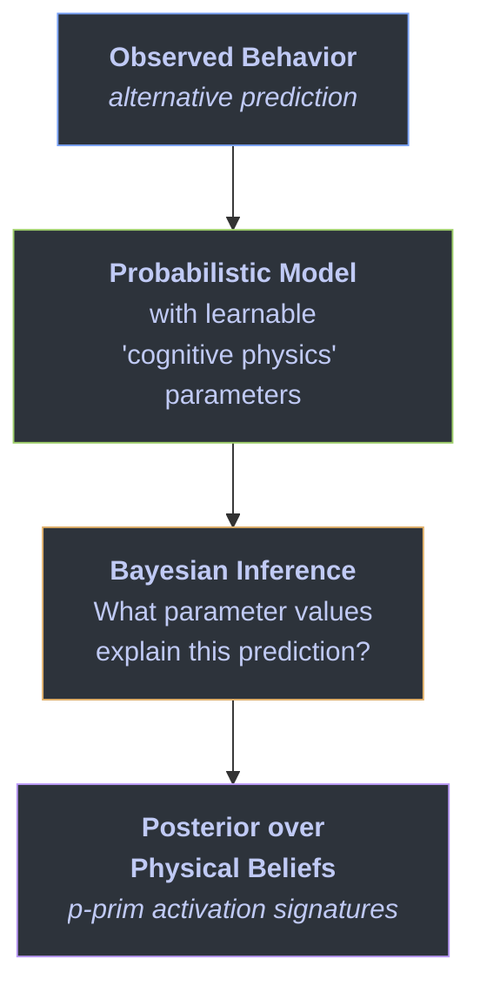
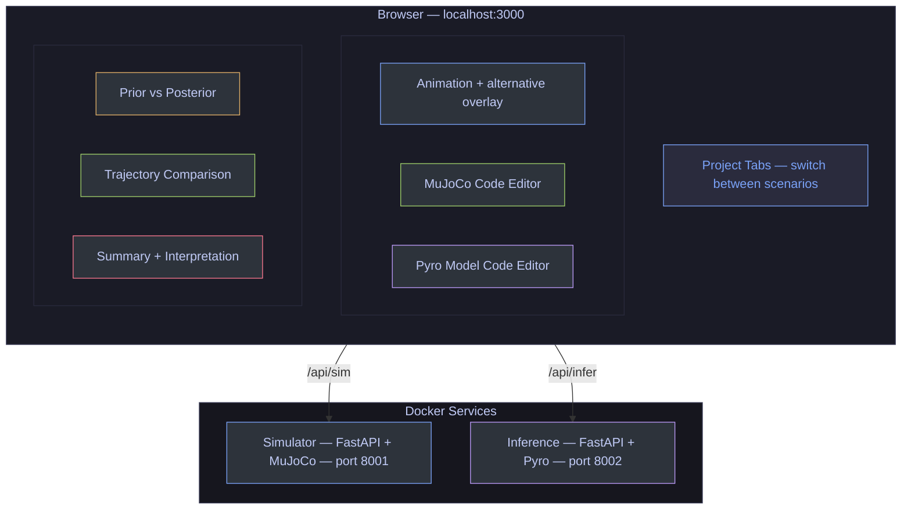

# pprim-probprog

**Inferring Phenomenological Primitive Activations Through Probabilistic Programming**

A browser-based tool that uses analysis-by-synthesis to find evidence for phenomenological primitive (p-prim) activation in students' physics predictions. Built on a MuJoCo physics engine and Pyro probabilistic programming framework.

---

## What This Project Does

Imagine a ball rolling horizontally across a table. Suddenly, a constant upward force is applied. **What path does the ball follow?**

Most people — including many students — predict that the ball goes **straight up**. Newtonian mechanics says it should curve **diagonally**, because the upward force *adds to* the existing horizontal velocity rather than replacing it.

This tool asks: **what implicit physical model would a person need to hold in order to expect the alternative (straight-up) outcome?** Rather than simply noting that the prediction differs from Newtonian mechanics, we use probabilistic inference to *quantify* the underlying beliefs — finding evidence for which intuitive knowledge elements (p-prims) are active in a given context.

> **Important caveat:** This tool infers parameter values *consistent with* a given prediction. It finds evidence for or against p-prim activation in a particular context — it does not claim to directly measure a person's cognitive structures. P-prims are theoretical constructs; the posteriors represent the best-fitting parameters of a generative model, interpreted through the lens of p-prim theory.

### The Connection to P-Prims

DiSessa's phenomenological primitives (p-prims) are the small, intuitive knowledge elements people use to reason about the physical world. Two p-prims are particularly relevant here:

- **"Force as mover"** — the intuition that a force *sets* an object's motion. If you push something up, it goes up. The prior motion is irrelevant. (Think of how we experience kicking a stationary ball — the ball goes where you kick it.)
- **Newtonian superposition** — force *changes* existing motion rather than replacing it. The ball was already moving right; an upward push makes it go diagonally. (Note: this is the Newtonian principle itself, not a p-prim — p-prims are the intuitive elements that may or may not align with formal physics.)

P-prims aren't just qualitative labels. This tool shows that p-prim activation corresponds to specific, measurable values of parameters in a generative physical model. When someone predicts the alternative trajectory, their implicit `velocity_persistence` parameter is near 0 — evidence that the "force as mover" p-prim is active. When someone predicts the Newtonian trajectory, that same parameter is near 1 (consistent with Newtonian superposition). This operationalization gives p-prims a continuous, quantitative characterization rather than a binary label.

---

## How It Works: Analysis-by-Synthesis

The approach follows an **analysis-by-synthesis** loop:



1. **We define a generative model** with tunable parameters that represent different physical beliefs — how much prior velocity persists when a new force is applied, how quickly motion decays, how strong the force feels, etc.

2. **We feed in the alternative trajectory** (ball goes straight up) as the "observed data."

3. **Bayesian inference searches** for parameter values that would produce this trajectory. It doesn't just find one answer — it finds a *distribution* of plausible values, telling us both what the person likely believes and how confident we can be.

4. **The posterior distribution** provides evidence about p-prim activation: a low `velocity_persistence` is consistent with the "force as mover" p-prim being active; a high value is consistent with Newtonian superposition.

---

## The Key Parameters

The probabilistic model exposes these "cognitive physics" parameters:

| Parameter | What it represents | Alternative value | Newtonian value |
|-----------|-------------------|-------------------|-----------------|
| **velocity_persistence** | Does force replace or add to existing motion? | ~0 (replaces) | ~1 (adds) |
| **lateral_damping** | How fast does horizontal motion die out? | High (motion stops) | ~0 (motion persists) |
| **force_magnitude** | How strong does the force feel? | Varies | Varies |
| **mass** | How heavy does the object feel? | Varies | Varies |

The first two parameters are the most diagnostic. Together, they capture the "force as mover" p-prim activation vs. Newtonian superposition in continuous, quantitative terms.

---

## Architecture

The system has three services that run in Docker:



- **Simulator service** — Runs MuJoCo physics simulations. Takes scene descriptions (MJCF XML), applies forces, returns trajectories and rendered frames.
- **Inference service** — Runs Pyro probabilistic programs. Takes an observed trajectory, fits the cognitive physics model, returns posterior distributions over belief parameters.
- **Frontend** — A 6-panel dashboard with project tabs, where you can edit the physics scene and the probabilistic model, run simulations and inference, and explore the results visually.

---

## Running the Tool

### Prerequisites

- [Docker](https://docs.docker.com/get-docker/) and Docker Compose

### Quick Start

```bash
git clone https://github.com/joelawalsh01/pprim-probprog.git
cd pprim-probprog
docker compose up --build
```

Then open **http://localhost:3000**.

### Using the Dashboard

1. **The diSessa ball scenario loads automatically** as a saved project — a ball with horizontal velocity and an upward force.

2. **Click "Simulate"** to run the MuJoCo physics engine. You'll see:
   - The Newtonian trajectory (ball curves diagonally — blue solid line)
   - The alternative trajectory overlay (ball goes straight up — red dashed line)
   - Rendered animation frames from the physics engine

3. **Click "Run Inference"** to ask: what physical beliefs explain the alternative prediction? The Pyro inference engine will:
   - Start from broad prior distributions over each parameter
   - Search for parameter values that would produce the alternative trajectory
   - Return posterior distributions showing the most likely belief values

4. **Explore the results:**
   - **Prior vs Posterior panel** — histograms showing how each parameter shifted from its prior. Look for `velocity_persistence` concentrating near 0.
   - **Trajectory panel** — visual comparison of Newtonian vs alternative paths.
   - **Summary panel** — parameter estimates, convergence plot, and a plain-English interpretation of what the posteriors mean in terms of physical intuitions.

### Project Tabs

The dashboard supports multiple projects via a tab bar below the header:

- **DiSessa Ball** is pre-loaded as the default project
- Click **"+"** to create a new blank project with a template MuJoCo scene
- **Switch between tabs** to work on different scenarios — each project retains its own MJCF, Pyro code, simulation results, and inference results independently
- **Double-click** a tab name to rename it
- **Close** a tab with the "×" button (at least one project must remain open)
- Projects are **persisted to localStorage** — they survive page refreshes

---

## For Researchers

### Editing the Pyro Model

The Pyro model code is fully editable in the dashboard. You can:

- **Change the priors** — what if you believe students have *some* Newtonian intuition? Set `velocity_persistence` prior to `Beta(5, 2)` instead of `Beta(2, 2)`.
- **Add parameters** — model additional p-prims like "closer means stronger" or "dying away."
- **Change the likelihood** — adjust how tightly the model must match the observed trajectory.

### Editing the Physics Scene

The MuJoCo XML is also editable. You can modify:

- Initial velocity, force magnitude, timing
- Object mass and size
- Whether gravity is present (default: off, to isolate the force question)

### Generating New Scenarios with AI

The repo includes a comprehensive scenario generation guide at [`claude-mujoco-md/SCENARIO_GENERATION_GUIDE.md`](claude-mujoco-md/SCENARIO_GENERATION_GUIDE.md). To create complete custom scenarios:

1. **Copy the guide** into a conversation with Claude (or any LLM)
2. **Describe the scenario** — e.g. "a ball on a ramp — students think heavier balls roll faster"
3. **The LLM generates three outputs**: MuJoCo XML, Pyro model code, and a P-Prim config JSON
4. **Paste each into the corresponding panel** in a new project tab:
   - MJCF XML → MuJoCo Code panel
   - Pyro model → Pyro Model > Code tab
   - P-Prim config → Pyro Model > P-Prims tab (via "Paste JSON")
5. **Click Simulate → Run Inference** → get meaningful p-prim interpretation

The guide covers:
- MuJoCo MJCF XML generation (geom types, joints, actuators, sensors, cameras)
- Pyro model design (how to map alternative conceptions to learnable parameters)
- P-Prim config format (thresholds, conceptions, interpretation text)
- A complete worked example (the DiSessa ball scenario) showing all three outputs
- A reference table of common p-prim → parameter mappings

This lets you prototype new physics intuition scenarios beyond the built-in DiSessa ball example — ramps, pendulums, collisions, circular motion, and more.

### Using Custom Trajectories

The inference endpoint accepts custom observed trajectories. You could feed in:

- **Student drawing data** — digitize a student's hand-drawn prediction
- **Interpolated trajectories** — test "halfway" predictions between alternative and Newtonian
- **Other scenarios** — circular motion, collisions, pendulums

---

## Theoretical Background

### DiSessa's P-Prims (1993)

Andrea diSessa proposed that physical intuition isn't organized as coherent theories but as a large collection of small, semi-independent knowledge elements — phenomenological primitives. These p-prims are:

- **Abstracted from experience** — built up through interaction with the physical world
- **Context-sensitive** — different p-prims activate in different situations
- **Not inherently wrong** — they work well in many everyday contexts but can lead to non-Newtonian predictions when applied to unfamiliar situations

The "force as mover" scenario in this tool is one of diSessa's canonical examples. A student activating the "force as mover" p-prim thinks about force as *setting* velocity directly, which works intuitively for starting stationary objects in motion but fails when an object already has velocity in a different direction.

### Analysis-by-Synthesis in Cognitive Science

Analysis-by-synthesis is the idea that perception and cognition work by running internal generative models and comparing their outputs to observations. This tool applies that framework to *belief extraction*: given what someone predicts, what generative model (what set of physical beliefs) would produce that prediction?

This connects to broader work on:

- **Probabilistic models of cognition** (Tenenbaum, Griffiths, et al.) — modeling cognitive processes as approximate Bayesian inference
- **Intuitive physics engines** (Battaglia, Hamrick, Tenenbaum) — the idea that people simulate physics internally
- **Theory theory vs. knowledge-in-pieces** — this tool operationalizes the knowledge-in-pieces view by treating beliefs as continuous parameters rather than discrete theory states

### Why Probabilistic Programming?

Traditional analysis would classify a student's prediction as having an "alternative conception" or being "Newtonian" — a binary label. Probabilistic programming gives us:

- **Continuous measurements** instead of categories — a student can be 30% Newtonian
- **Uncertainty quantification** — we know how confident we are about the extracted beliefs
- **Compositional models** — we can add or remove belief parameters and re-run inference
- **Prior sensitivity analysis** — we can ask how the results change under different assumptions about what students might believe

---

## Project Structure

```
pprim-probprog/
├── docker-compose.yml              # Runs all 3 services
├── claude-mujoco-md/
│   ├── SCENARIO_GENERATION_GUIDE.md  # Complete guide for generating scenarios (MJCF + Pyro + P-Prims)
│   └── MUJOCO_GENERATION_GUIDE.md    # Legacy MJCF-only reference
├── frontend/                       # React + Vite + TypeScript dashboard
│   └── src/
│       ├── App.tsx                 # Project state management + localStorage
│       ├── types.ts                # Project, SimulationResult, InferenceResult types
│       └── components/
│           ├── Dashboard.tsx       # Layout + project tab bar
│           ├── AnimationPanel.tsx  # Physics animation + alternative overlay
│           ├── MujocoCodePanel.tsx # Editable MJCF XML
│           ├── PyroCodePanel.tsx   # Editable Pyro model
│           ├── PriorPosteriorPanel.tsx  # Distribution histograms
│           ├── TrajectoryPanel.tsx      # Path comparison plot
│           └── SummaryPanel.tsx         # Results + interpretation
├── services/
│   ├── simulator/                  # FastAPI + MuJoCo
│   │   └── src/
│   │       ├── simulation.py       # Physics engine + alternative trajectory
│   │       └── renderer.py         # Offscreen frame rendering
│   └── inference/                  # FastAPI + Pyro
│       └── src/
│           ├── models.py           # Probabilistic cognitive physics model
│           └── inference.py        # SVI + MCMC runners
└── scene-inspo-images/
    └── disessa.png                 # Reference diagram
```

---

## References

- diSessa, A. A. (1993). Toward an epistemology of physics. *Cognition and Instruction*, 10(2-3), 105-225.
- diSessa, A. A., & Sherin, B. L. (1998). What changes in conceptual change? *International Journal of Science Education*, 20(10), 1155-1191.
- Smith, J. P., diSessa, A. A., & Roschelle, J. (1993). Misconceptions reconceived: A constructivist analysis of knowledge in transition. *Journal of the Learning Sciences*, 3(2), 115-163.
- Battaglia, P. W., Hamrick, J. B., & Tenenbaum, J. B. (2013). Simulation as an engine of physical scene understanding. *PNAS*, 110(45), 18327-18332.
- Goodman, N. D., & Stuhlmuller, A. (2014). *The Design and Implementation of Probabilistic Programming Languages.* http://dippl.org
- Bingham, E., et al. (2019). Pyro: Deep Universal Probabilistic Programming. *JMLR*, 20(28), 1-6.

---

*Built with [MuJoCo](https://mujoco.org/), [Pyro](https://pyro.ai/), React, and FastAPI.*
